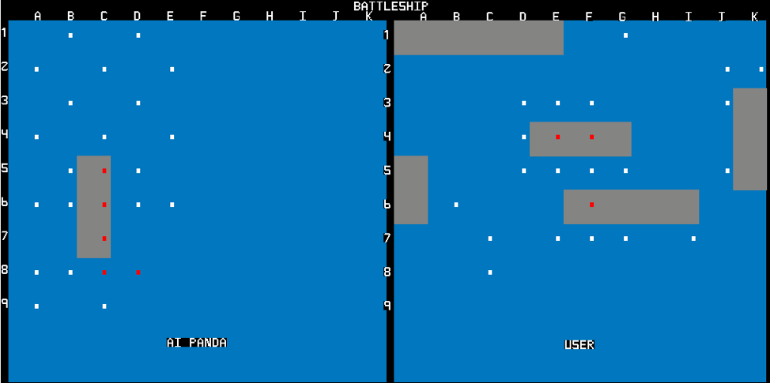
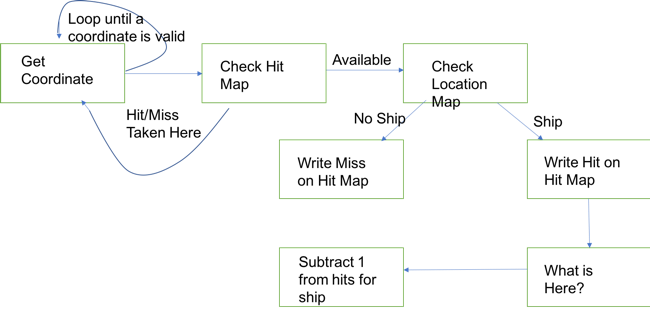
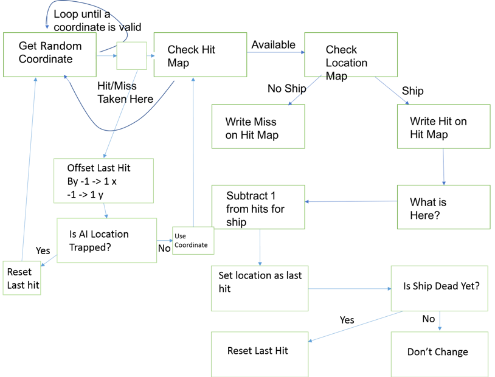
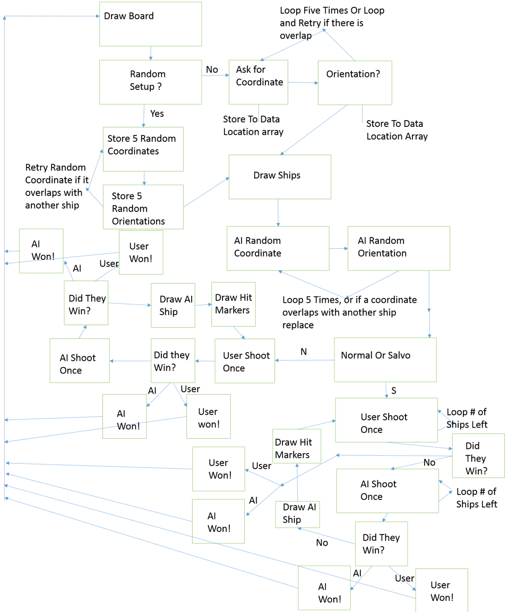
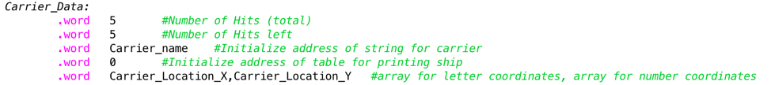

# BattleShip (Admiral Edition)

## By Michael DeLeo

## 2016

### WHAT IS THIS GAME

BattleShip is a two-player game, where each player has a board with coordinates A-K (x axis), and 1-9 (y axis) and five ships each (Aircraft Carrier, Battleship, Submarine, Cruiser, Destroyer). The objective of the game is to eliminate the opponents ships by hitting every section of every ship they have. Admiral Edition is what I call this version, because it has Salvo Mode (as is explained earlier).

A Bitmap Display is setup in MARS as:

Pixel Width = 1Pixel Height = 1
Display Width = 1024
Display Height = 512

Keyboard polling is taken from the Mars I/O prompt.

### HOW DOES IT WORK

The Program first draws a divided board with coordinates A-K x axis and coordinates 1-9 y axis. The program displays on the prompt the rules of the game, and then prompts the user for random or selected positions for their ships. Manual setup will ask for upper left coordinate and orientation, and then will add those values to the ship’s location arrays in the respective direction. For example, refer to Table 1 with Carrier locations. This ship starts at A1 (x 1, y 1) and ends at A5 (x 1, y 5), so its upper left corner is A1 and orientation is down. This is done for all ships, and will redo the starting location if there is overlap with another ship. The same is done for AI, but only randomly.

Table 1
Carrier_location_x    1    1    1    1    1
Carrier_location_y    1    2    3    4    5

After setup, the program prompts the user with a description of Normal Mode and Salvo mode, and then prompts for their choice. Salvo is when an entire fleet fires all at once, so if chosen the user will give the coordinates for the ship’s “Weapons Systems”, for each ship that is alive ( format is X: letter coordinate, Y: Number coordinate). So, if the user has 4 ships left, then they get 4 shots, and once they submit their shots they are fired. After they are fired, the AI takes a turn and gives a random coordinate (or one near a ship if there is a previous hit). The same rule of number of ships = number of sots for the AI, and this is why this mode is my favorite, because it is challenging. If you find a ship, you can assign all your ships to attack that area, while your opponent has not found your ships, so it becomes a fleet versus a single ship. This makes it very easy to lose the edge in this mode, because if the AI targets a ship, your fleet can be crippled in a few rounds.
Normal Mode gets one coordinate from the User, fires, and gets one coordinate from the AI, and fires. It is important to note that there is no overlapping of the coordinates, if a coordinate has already been fired upon, it cannot be targeted again. For both modes, once the shot(s) are fired the hit markers are refreshed on the screen from the 2D Hit Map Arrays, and displayed as White for a miss, and Red for a hit.  

FlowChart 1

FlowChart 2

FlowChart 3

FlowChart 1 is the User Shoot Once Function, FlowChart 2 is the AI Shoot Once Function, FlowChart 3 is the FlowChart for the game. It some of the functions I do not go in depth, for my own sanity because there would be at least three more pages.

### CHALLENGES

There were a lot of challenges to this project, the total length of the code (as of right now) is 2784 lines of code. There was a challenge to implementing salvo mode into myproject, I had to decide right away if I wanted to include salvo or not, because I had to structure all of the data and functions a certain way or else I would be fighting it the whole time. I structured my data in such a way that was similar to Class structures in C++. 

See figure 2 for an example of this with the User Aircraft Carrier. There is data for Total Hits for a carrier, number of hits left, name of ship, printing data (not used, but will be if I revisit this code. Will be used for different ship designs), and the ship’s location x array, and ship’s location y array. The data in these ships structured is changed with a function like Write_Hits which needs the label to the ship and data to write with, and will call Write_Ship_Data with the selection of which data to write to and then will access that data and write with data given. All Write_Data functions call Write_Ship_Data to deal with where to store the data given to write with. The same goes for Access_Hits, it will call Access_Ship_Data and do something similar. This is the same procedure for all of the access/write data functions.

Figure 2

This is a challenge because I basically had to create my own methods of handling data, and create a data structure for everything in my program and allow it work well with normal and salvo mode.
    Another challenge I had was with working with the 2D Arrays, which there are four of (two hit maps one for each player, and two location maps one for each player). I wrote a function to access the data arrays (all it needs is the label since they are all the same size), and one to write to them). I had issues with writing to them, but I fixed this by keeping everything standard with how I access and wrote to the arrays.

Other than writing to data, the AI shoot function was one of the last things I wrote, and because it was one of the last it was difficult to debug because I had to guess where the program would be, or even what it thinks it is doing there. The AI shoot function follows the flow diagram seen in Figure 3, if there is a previous shot then it will try shooting around that location, otherwise it will go random. Sometimes AI shoot would go to some far-off place in the program and decide to shoot fifty million times, and that’s cool and all but it sort of makes your computer freak out when the processor overheats.

    Another challenge to the project is that I described the AI Panda as Semi-Intelligent in the proposal, and it must have heard me because it turns out that the AI is around 50% accurate with its shots, so it is in fact intelligent and it is scary to play against it.
    
    I’m very proud of this program that I wrote, it took a lot of effort to make. This project makes me more confident about programming in assembly and in other languages. 
